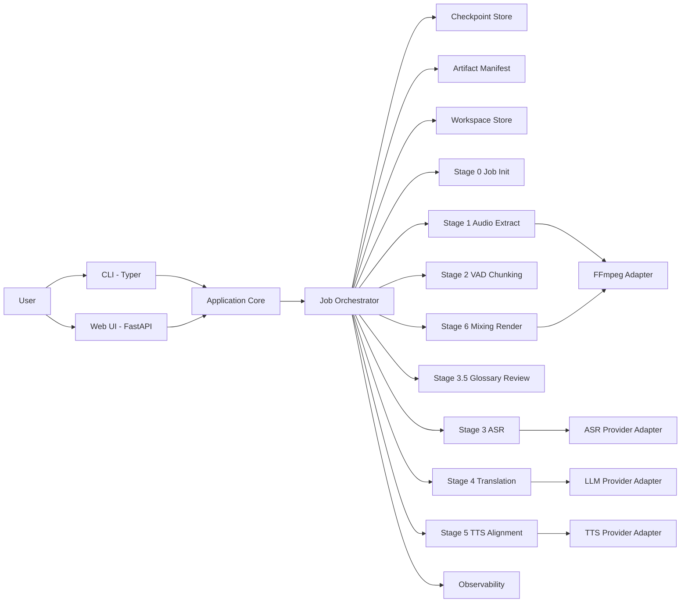

# FINAL IMPLEMENTATION PLAN v3  
# Hệ thống thuyết minh video tự động tiếng Việt — Commentary Dubbing Pipeline

**Phiên bản:** 3.0 — Final Implementation Plan  
**Mục tiêu:** Có thể bắt đầu implement trực tiếp từ tài liệu này  
**Đầu ra chính:** Video tiếng Việt dạng Commentary Mode — giọng Việt đè nhẹ giọng gốc, giữ âm thanh nền  
**Đối tượng nội dung:** Podcast, edu-video, lecture, video giải thích chuyên sâu kiểu 3Blue1Brown  
**Giao diện ưu tiên:** CLI-first, Web UI theo dõi tiến trình  
**Hạ tầng AI:** OpenAI-compatible cho ASR / LLM / TTS  
**Chiến lược triển khai:** Modular monolith, một video tại một thời điểm, async nội bộ cho ASR/TTS/LLM, có checkpoint/resume từ giai đoạn đầu  

---

# 1. Executive Summary

Plan cuối cùng giữ lõi thiết kế ban đầu:

1. Trích xuất và xử lý âm thanh.
2. VAD chunking.
3. ASR.
4. Glossary extraction + human review.
5. Translation có glossary.
6. TTS.
7. Time alignment.
8. Audio mixing theo Commentary Mode.
9. Render video đầu ra.

Tuy nhiên, bản final bổ sung các phần bắt buộc để triển khai ổn định:

- Stage 0: Job Init & Input Validation.
- Modular monolith + provider adapters.
- Artifact Manifest làm source of truth.
- Checkpoint/resume theo stage và segment.
- JSON schema cho mọi artifact.
- Idempotent write cho mọi bước.
- Glossary memory và glossary lock.
- Translation validation và compression pass.
- Duration planner trước TTS.
- Audio QA report.
- Observability tối thiểu: logs, metrics, trace.
- Golden dataset và crash injection tests.
- Security baseline cho file input, API keys, provider calls.

Nếu chỉ chọn 3 việc để code đầu tiên:

1. **Dựng core schema + config loader.**
2. **Dựng Job Orchestrator + Artifact Manifest + Checkpoint Store.**
3. **Làm vertical slice 1 phút end-to-end: input video → output mp4.**

---

# 2. Phạm vi sản phẩm

## 2.1. In scope

Hệ thống v1 cần làm được:

- Nhận một video đầu vào.
- Tách audio từ video.
- Tách giọng nói/background khi cần.
- Cắt audio thành segment bằng VAD.
- Gửi từng segment sang ASR.
- Extract glossary từ transcript.
- Dừng để người dùng review glossary.
- Resume sau khi glossary được duyệt.
- Dịch transcript sang tiếng Việt có kiểm soát thuật ngữ.
- Tổng hợp giọng Việt bằng TTS.
- Canh thời lượng TTS với timestamp gốc.
- Trộn giọng Việt, giọng gốc đã ducking, và background.
- Render video mp4 hoàn chỉnh.
- Cho phép resume khi crash.
- Xuất báo cáo QA cuối job.

## 2.2. Out of scope cho v1

Chưa làm trong v1:

- Multi-user.
- Multi-job parallel processing.
- Microservices.
- Kubernetes.
- Queue phức tạp.
- Subtitle editor đầy đủ.
- Real-time dubbing.
- Voice cloning.
- Web-based glossary editor phức tạp.
- Auto-publish lên YouTube/Facebook.
- Payment/user account system.

---

# 3. Quyết định kiến trúc cuối cùng

## 3.1. Chọn modular monolith

Không tách microservices ở giai đoạn đầu. Lý do:

- Hệ thống chỉ xử lý một video tại một thời điểm.
- CLI là chính, Web UI chỉ theo dõi.
- Bottleneck nằm ở media processing và API calls.
- Microservices sẽ làm tăng độ phức tạp deployment, logging, retry, data consistency.
- Modular monolith vẫn đủ sạch nếu chia boundary đúng.

## 3.2. Chuẩn kiến trúc



---

# 4. Công nghệ đề xuất

## 4.1. Runtime

- Python 3.11+ hoặc 3.12+
- Typer cho CLI
- FastAPI cho Web UI / local API
- Pydantic cho config và artifact schema
- httpx/aiohttp cho async provider calls
- FFmpeg cho audio/video processing
- Demucs hoặc Spleeter cho source separation nếu cần
- webrtcvad / silero-vad / pyannote tùy lựa chọn VAD
- pytest cho testing
- ruff + mypy cho lint/type check

## 4.2. Lưu trữ giai đoạn đầu

Dùng file-based workspace:

```text
workspace/
  {job_id}/
    job_state.json
    manifest.json
    config.resolved.yaml
    input/
    audio/
    raw/
    artifacts/
    tts/
    output/
    logs/
```

Không cần database trong v1. Nhưng code phải có interface để sau này thay bằng DB/object storage.

---

# 5. Cấu trúc project cuối cùng

```text
video-dubber/
├── README.md
├── pyproject.toml
├── config.example.yaml
├── .env.example
├── .gitignore
├── cli.py
├── web/
│   ├── app.py
│   ├── routes.py
│   ├── websocket.py
│   └── templates/
├── dubber/
│   ├── __init__.py
│   ├── core/
│   │   ├── config.py
│   │   ├── models.py
│   │   ├── enums.py
│   │   ├── errors.py
│   │   ├── paths.py
│   │   └── utils.py
│   ├── orchestrator/
│   │   ├── job_manager.py
│   │   ├── checkpoint_store.py
│   │   ├── artifact_manifest.py
│   │   ├── stage_runner.py
│   │   └── resume_policy.py
│   ├── audio/
│   │   ├── extractor.py
│   │   ├── analyzer.py
│   │   ├── separator.py
│   │   ├── vad.py
│   │   └── loudness.py
│   ├── asr/
│   │   ├── service.py
│   │   └── normalizer.py
│   ├── glossary/
│   │   ├── extractor.py
│   │   ├── reviewer.py
│   │   ├── memory.py
│   │   └── validator.py
│   ├── translation/
│   │   ├── translator.py
│   │   ├── block_builder.py
│   │   ├── validator.py
│   │   └── compressor.py
│   ├── tts/
│   │   ├── synthesizer.py
│   │   ├── duration_planner.py
│   │   ├── aligner.py
│   │   └── manifest.py
│   ├── mixing/
│   │   ├── ducking.py
│   │   ├── mixer.py
│   │   ├── renderer.py
│   │   └── qa.py
│   ├── providers/
│   │   ├── base.py
│   │   ├── asr_openai_compatible.py
│   │   ├── llm_openai_compatible.py
│   │   ├── tts_openai_compatible.py
│   │   └── ffmpeg.py
│   ├── observability/
│   │   ├── logger.py
│   │   ├── metrics.py
│   │   └── events.py
│   └── prompts/
│       ├── glossary_extract.md
│       ├── translate_block.md
│       └── compress_translation.md
├── schemas/
│   ├── job_state.schema.json
│   ├── manifest.schema.json
│   ├── segments.schema.json
│   ├── transcript.schema.json
│   ├── glossary.schema.json
│   ├── translated.schema.json
│   ├── tts_manifest.schema.json
│   └── qa_report.schema.json
├── tests/
│   ├── unit/
│   ├── integration/
│   ├── golden/
│   └── fixtures/
└── docs/
    ├── design_v3.md
    ├── adr/
    │   ├── 0001-modular-monolith.md
    │   ├── 0002-file-artifact-store.md
    │   ├── 0003-provider-adapters.md
    │   └── 0004-checkpoint-manifest.md
    └── runbook.md
```

---

# 6. Pipeline cuối cùng

## Stage 0 — Job Init & Input Validation

### Mục tiêu

Tạo job, validate input, chuẩn hóa config, tạo workspace.

### Input

- Video file: `.mp4`, `.mkv`, `.mov`
- Config profile: `mathematics`, `podcast`, `general_edu`
- Output mode: `commentary`

### Xử lý

1. Validate path.
2. Validate file size.
3. Validate extension.
4. Dùng FFmpeg/ffprobe đọc metadata.
5. Kiểm tra audio stream.
6. Tạo `job_id`.
7. Tạo workspace.
8. Copy hoặc reference input file.
9. Resolve config từ `config.yaml` + CLI args + env vars.
10. Ghi `job_state.json`.
11. Ghi `manifest.json`.

### Output

```text
workspace/{job_id}/job_state.json
workspace/{job_id}/manifest.json
workspace/{job_id}/config.resolved.yaml
workspace/{job_id}/input/input_metadata.json
```

### Acceptance criteria

- File lỗi phải báo rõ lý do.
- Không cho path traversal.
- Không chạy tiếp nếu thiếu audio stream.
- `job_id` duy nhất.
- Workspace tạo đúng cấu trúc.

---

## Stage 1 — Audio Extract & Optional Source Separation

### Mục tiêu

Tách audio từ video, phân tích audio, quyết định có cần source separation không.

### Input

- Video gốc.
- Config audio.

### Xử lý

1. FFmpeg extract audio thành WAV chuẩn.
2. Chuẩn hóa sample rate, ví dụ 16k/44.1k tùy ASR.
3. Tạo `original.wav`.
4. Chạy audio analysis:
   - duration
   - loudness
   - speech ratio
   - silence ratio
   - noise/background estimate
5. Nếu `source_separation=never`: dùng original làm vocals.
6. Nếu `source_separation=always`: chạy Demucs/Spleeter.
7. Nếu `source_separation=auto`: chỉ chạy separation khi audio analysis cho thấy background đáng kể.

### Output

```text
audio/original.wav
audio/vocals.wav
audio/background.wav
artifacts/audio_analysis.v1.json
```

### Artifact: `audio_analysis.v1.json`

```json
{
  "schema_version": "1.0",
  "audio_duration_ms": 3600000,
  "sample_rate": 44100,
  "channels": 2,
  "loudness_lufs": -18.2,
  "speech_ratio": 0.72,
  "silence_ratio": 0.18,
  "source_separation_used": true,
  "source_separation_reason": "background_detected"
}
```

### Acceptance criteria

- Audio duration gần bằng video duration.
- `vocals.wav` và `background.wav` tồn tại.
- Nếu bỏ qua separation, vẫn tạo background hợp lệ hoặc mapping rõ trong manifest.
- Không overwrite artifact đã completed nếu hash hợp lệ.

---

## Stage 2 — VAD Chunking

### Mục tiêu

Chia `vocals.wav` thành các đoạn có timestamp ổn định, không cắt giữa câu quá nhiều.

### Input

- `vocals.wav`
- `audio_analysis.v1.json`

### Xử lý

1. Chạy VAD.
2. Tạo speech intervals.
3. Merge đoạn quá ngắn.
4. Split đoạn quá dài.
5. Ưu tiên split theo silence.
6. Nếu không có silence, split mềm và đánh dấu warning.
7. Xuất `segments.v1.json`.

### Config đề xuất

```yaml
vad_min_duration_ms: 3000
vad_max_duration_ms: 25000
silence_merge_threshold_ms: 400
soft_split_allowed: true
```

### Artifact: `segments.v1.json`

```json
{
  "schema_version": "1.0",
  "job_id": "abc123",
  "source_audio": "audio/vocals.wav",
  "segments": [
    {
      "segment_id": "seg_000001",
      "start_ms": 1200,
      "end_ms": 8700,
      "duration_ms": 7500,
      "silence_before_ms": 400,
      "silence_after_ms": 650,
      "speech_probability": 0.96,
      "split_reason": "vad_silence",
      "risk_flags": []
    }
  ]
}
```

### Acceptance criteria

- Segment không overlap.
- Segment sort theo `start_ms`.
- Tổng segment duration hợp lý so với speech ratio.
- Không có segment dưới min trừ khi có flag.
- Không có segment trên max trừ khi có flag.

---

## Stage 3 — ASR

### Mục tiêu

Nhận diện text gốc từ từng segment.

### Input

- `segments.v1.json`
- `vocals.wav`

### Xử lý

1. Cắt audio theo segment.
2. Gửi segment audio tới ASR provider.
3. Dùng async concurrency có giới hạn.
4. Retry từng segment khi lỗi.
5. Chuẩn hóa output provider.
6. Lưu raw response để debug.
7. Đánh dấu segment rủi ro.

### Config đề xuất

```yaml
asr:
  concurrency: 4
  retry_max_attempts: 3
  retry_backoff_sec: 2
  language: en
```

### Artifact: `transcript.v1.json`

```json
{
  "schema_version": "1.0",
  "provider": {
    "type": "openai_compatible",
    "model": "whisper-1"
  },
  "segments": [
    {
      "segment_id": "seg_000001",
      "start_ms": 1200,
      "end_ms": 8700,
      "source_text": "Let's talk about eigenvectors.",
      "confidence": 0.91,
      "asr_warnings": [],
      "raw_response_path": "raw/asr/seg_000001.json"
    }
  ]
}
```

### Risk flags

- `low_confidence`
- `empty_transcript`
- `possible_math_symbol`
- `possible_proper_noun`
- `duration_text_mismatch`
- `provider_retry_exceeded`

### Acceptance criteria

- Số segment transcript = số segment input.
- Mỗi segment có `segment_id`.
- Segment lỗi không làm hỏng toàn bộ job nếu còn retry được.
- Segment không thể nhận diện phải được flag, không được im lặng bỏ qua.

---

## Stage 3.5 — Glossary Extraction & Review

### Mục tiêu

Trích xuất thuật ngữ chuyên ngành trước khi dịch để đảm bảo nhất quán.

### Input

- `transcript.v1.json`
- Domain profile, ví dụ `mathematics`.

### Xử lý

1. Gom transcript theo block lớn.
2. Gửi LLM extract glossary.
3. LLM trả về danh sách term.
4. Merge với glossary memory nếu bật.
5. Detect conflict nếu cùng term có nhiều cách dịch.
6. Xuất `glossary.draft.json`.
7. Pipeline dừng ở trạng thái `waiting_review`.
8. Người dùng review/sửa file.
9. Người dùng chạy `dubber resume --job {job_id}`.
10. Validate reviewed glossary.
11. Tạo `glossary.locked.json`.

### Artifact: `glossary.draft.json`

```json
{
  "schema_version": "1.0",
  "domain": "mathematics",
  "status": "draft",
  "terms": [
    {
      "term_id": "term_0001",
      "original": "eigenvector",
      "vietnamese": "vectơ riêng",
      "category": "math_term",
      "confidence": 0.94,
      "source_segments": ["seg_000012", "seg_000048"],
      "occurrence_count": 6,
      "status": "needs_review",
      "locked": false,
      "notes": ""
    }
  ]
}
```

### Artifact sau review: `glossary.locked.json`

```json
{
  "schema_version": "1.0",
  "domain": "mathematics",
  "status": "locked",
  "terms": [
    {
      "term_id": "term_0001",
      "original": "eigenvector",
      "vietnamese": "vectơ riêng",
      "category": "math_term",
      "locked": true,
      "source_segments": ["seg_000012", "seg_000048"],
      "notes": "Dùng thống nhất cho toàn series."
    }
  ]
}
```

### Acceptance criteria

- Pipeline bắt buộc dừng nếu `glossary_review=true`.
- Resume không chạy Stage 4 nếu chưa có `glossary.locked.json`.
- File glossary reviewed phải pass schema.
- Thuật ngữ locked không được bị dịch khác ở Stage 4.

---

## Stage 4 — Translation

### Mục tiêu

Dịch transcript sang tiếng Việt, giữ đúng timestamp và thuật ngữ.

### Input

- `transcript.v1.json`
- `glossary.locked.json`
- Translation profile.

### Xử lý

1. Build block với sliding window.
2. Mỗi block gồm 8–12 segment.
3. Overlap 2 segment để giữ ngữ cảnh.
4. LLM trả output JSON schema cứng.
5. Validate số segment.
6. Validate `segment_id`.
7. Validate glossary.
8. Tính length ratio.
9. Nếu đoạn quá dài, chạy compression pass.
10. Xuất `translated.v1.json`.

### Prompt rule bắt buộc

LLM phải:

- Trả đúng JSON.
- Không thêm segment.
- Không bỏ segment.
- Không đổi `segment_id`.
- Dùng đúng glossary locked.
- Dịch súc tích, tự nhiên, phù hợp thuyết minh.
- Không dịch quá dài nếu không cần thiết.
- Giữ ký hiệu toán học/tên riêng đúng.

### Artifact: `translated.v1.json`

```json
{
  "schema_version": "1.0",
  "segments": [
    {
      "segment_id": "seg_000001",
      "source_text": "Let's talk about eigenvectors.",
      "vi_text": "Hãy nói về vectơ riêng.",
      "used_terms": ["eigenvector"],
      "length_ratio": 0.82,
      "translation_warnings": []
    }
  ]
}
```

### Acceptance criteria

- Số segment output = input.
- Không sai glossary locked.
- Không có `vi_text` rỗng.
- Segment quá dài phải có warning hoặc được compression.
- File output pass schema.

---

## Stage 5 — TTS + Duration Planning + Alignment

### Mục tiêu

Tạo giọng Việt và căn thời lượng khớp với mốc thời gian gốc.

### Input

- `translated.v1.json`
- `segments.v1.json`
- Config TTS.

### Xử lý

1. Duration Planner ước lượng thời lượng tiếng Việt.
2. Nếu dự đoán quá dài, chạy compression trước TTS.
3. Gửi text sang TTS provider.
4. Đo duration audio thực tế.
5. So sánh `T_tts` với `T_orig`.
6. Nếu ngắn hơn: thêm silence tự nhiên.
7. Nếu dài nhẹ: time-stretch.
8. Nếu dài quá: rephrase/rút gọn lại.
9. Nếu vẫn dài: cho overflow có kiểm soát vào silence tiếp theo.
10. Ghi warning vào `tts_manifest.v1.json`.

### Ngưỡng xử lý

| Tỷ lệ TTS/original | Xử lý |
|---|---|
| <= 1.00 | Giữ nguyên, thêm silence |
| 1.00–1.20 | Time-stretch nhẹ |
| 1.20–1.30 | Time-stretch + warning |
| > 1.30 | Rephrase trước khi stretch |
| Vẫn > 1.30 | Overflow có kiểm soát + flag review |

### Artifact: `tts_manifest.v1.json`

```json
{
  "schema_version": "1.0",
  "segments": [
    {
      "segment_id": "seg_000001",
      "target_start_ms": 1700,
      "target_end_ms": 8700,
      "original_start_ms": 1200,
      "original_end_ms": 8700,
      "commentary_delay_ms": 500,
      "orig_duration_ms": 7500,
      "tts_duration_ms": 7200,
      "stretch_ratio": 1.0,
      "overflow_ms": 0,
      "audio_path": "tts/seg_000001.wav",
      "warnings": []
    }
  ]
}
```

### Acceptance criteria

- Mỗi segment translated có một audio TTS tương ứng.
- Audio file tồn tại và duration đo được.
- Segment vượt hard limit phải có warning.
- Resume TTS không tạo lại segment đã done nếu hash hợp lệ.

---

## Stage 6 — Commentary Mixing & Render

### Mục tiêu

Trộn giọng Việt, giọng gốc và background thành video hoàn chỉnh.

### Commentary Mode

Logic gốc:

```text
t = 0.0s: giọng Anh gốc bắt đầu, âm lượng bình thường
t = 0.5s: giọng Việt bắt đầu
khi giọng Việt phát: giọng Anh giảm xuống khoảng -20dB đến -25dB
khi giọng Việt kết thúc: giọng Anh fade trở lại
background giữ nguyên tương đối
```

### Xử lý

1. Normalize loudness từng track.
2. Build TTS timeline.
3. Tạo ducking envelope cho vocals gốc.
4. Mix background + TTS + ducked vocals.
5. Render audio final.
6. Ghép audio final vào video gốc.
7. Validate output duration.
8. Xuất QA report.

### Output

```text
output/{input_name}_vi.mp4
output/{input_name}_vi.report.json
output/{input_name}_vi.qa.json
```

### QA report

```json
{
  "schema_version": "1.0",
  "job_id": "abc123",
  "input_duration_ms": 3600000,
  "output_duration_ms": 3600200,
  "segments_total": 312,
  "low_confidence_segments": 8,
  "glossary_terms": 47,
  "tts_overflow_segments": 12,
  "max_overflow_ms": 640,
  "sync_drift_p95_ms": 180,
  "warnings": [
    "12 segments exceeded soft TTS duration limit"
  ]
}
```

### Acceptance criteria

- Output video mở được.
- Duration output gần bằng input.
- Không mất background.
- Không bị chồng tiếng quá mức.
- Ducking nghe tự nhiên.
- Có QA report cuối job.

---

# 7. Checkpoint, Manifest và Resume

## 7.1. Nguyên tắc

Mọi stage phải:

- Đọc input artifact từ manifest.
- Chạy xử lý.
- Ghi output tạm.
- Validate output.
- Tính hash.
- Rename atomic.
- Cập nhật manifest.
- Cập nhật job_state.

Không được coi stage là completed chỉ vì file tồn tại.

## 7.2. `job_state.json`

```json
{
  "schema_version": "1.0",
  "job_id": "abc123",
  "status": "running",
  "current_stage": "tts",
  "input_file": "input/lecture.mp4",
  "stages": {
    "job_init": {
      "status": "completed"
    },
    "audio_extract": {
      "status": "completed",
      "artifact": "audio_analysis.v1.json"
    },
    "vad": {
      "status": "completed",
      "artifact": "segments.v1.json"
    },
    "asr": {
      "status": "completed",
      "done": 312,
      "total": 312
    },
    "glossary": {
      "status": "completed",
      "artifact": "glossary.locked.json"
    },
    "translation": {
      "status": "completed",
      "done": 312,
      "total": 312
    },
    "tts": {
      "status": "running",
      "done": 247,
      "total": 312
    },
    "mixing": {
      "status": "pending"
    }
  },
  "last_error": null,
  "created_at": "2026-06-24T09:00:00+07:00",
  "updated_at": "2026-06-24T09:30:00+07:00"
}
```

## 7.3. `manifest.json`

```json
{
  "schema_version": "1.0",
  "job_id": "abc123",
  "artifacts": [
    {
      "name": "segments",
      "version": 1,
      "path": "artifacts/segments.v1.json",
      "sha256": "abc...",
      "created_by_stage": "vad",
      "schema_version": "1.0",
      "created_at": "2026-06-24T09:05:00+07:00"
    }
  ]
}
```

## 7.4. Resume policy

| Trạng thái | Hành động |
|---|---|
| Stage completed + artifact hash valid | Skip stage |
| Stage completed + artifact hash invalid | Mark corrupt, rollback hoặc rerun stage |
| Stage running + partial segment progress | Resume từ segment chưa done |
| Glossary waiting_review | Dừng, báo user review |
| Config thay đổi | Kiểm tra stage nào bị ảnh hưởng, yêu cầu recompute |
| Provider lỗi tạm thời | Retry segment |
| Provider lỗi vĩnh viễn | Mark segment failed, job partial_failed hoặc stop tùy config |

---

# 8. Config cuối cùng

```yaml
project:
  name: video-dubber
  output_format: mp4
  domain: mathematics
  output_dir: ./output
  workspace_dir: ./workspace

runtime:
  max_parallel_jobs: 1
  asr_concurrency: 4
  llm_concurrency: 2
  tts_concurrency: 4
  retry_max_attempts: 3
  retry_backoff_sec: 2
  request_timeout_sec: 120

input:
  allowed_extensions: [".mp4", ".mkv", ".mov"]
  max_file_size_mb: 4096
  max_duration_minutes: 180

audio_processing:
  source_separation: auto
  vad_min_duration_ms: 3000
  vad_max_duration_ms: 25000
  silence_merge_threshold_ms: 400
  soft_split_allowed: true
  loudness_target_lufs: -16

asr_service:
  provider: openai_compatible
  base_url: ${ASR_BASE_URL}
  api_key: ${ASR_API_KEY}
  model: whisper-1
  language: en

llm_service:
  provider: openai_compatible
  base_url: ${LLM_BASE_URL}
  api_key: ${LLM_API_KEY}
  model: gpt-4o-mini
  temperature: 0.3

translation:
  block_size: 10
  sliding_window_overlap: 2
  max_length_ratio: 1.15
  compression_pass_enabled: true
  glossary_review: true
  glossary_memory_enabled: true

tts_service:
  provider: openai_compatible
  base_url: ${TTS_BASE_URL}
  api_key: ${TTS_API_KEY}
  model: tts-1
  voice: nova
  speed: 1.0

tts_alignment:
  commentary_delay_ms: 500
  speedup_soft_limit: 1.2
  speedup_hard_limit: 1.3
  allow_overflow_into_silence: true
  max_overflow_ms: 800

mixing:
  original_voice_ducking_db: -22
  ducking_fade_ms: 120
  final_loudness_normalization: true
  keep_background: true

observability:
  log_format: json
  enable_trace: true
  metrics_enabled: true

web_ui:
  enabled: true
  host: 127.0.0.1
  port: 8080
```

---

# 9. CLI cuối cùng

## 9.1. Chạy job mới

```bash
dubber run --input lecture.mp4 --domain mathematics
```

## 9.2. Resume job

```bash
dubber resume --job abc123
```

## 9.3. Xem trạng thái job

```bash
dubber status --job abc123
```

## 9.4. List jobs

```bash
dubber jobs
```

## 9.5. Validate artifacts

```bash
dubber validate --job abc123
```

## 9.6. Re-run một stage

```bash
dubber rerun --job abc123 --stage translation
```

## 9.7. Re-run một segment

```bash
dubber rerun-segment --job abc123 --stage tts --segment seg_000247
```

## 9.8. Mở Web UI

```bash
dubber web
```

---

# 10. Web UI scope

## v1

Web UI chỉ cần:

- Dashboard job hiện tại.
- Progress theo stage.
- Progress theo segment.
- Hiển thị trạng thái glossary review.
- Hiển thị warnings.
- Hiển thị QA report.
- Preview/download output.
- Xem lịch sử job.

## Chưa cần trong v1

- Edit glossary trên Web.
- Edit subtitle.
- Re-run bằng UI phức tạp.
- Multi-user.
- Login/auth.
- Cloud dashboard.

---

# 11. Provider Adapter Contract

## 11.1. ASR Provider

```python
class ASRProvider:
    async def transcribe(self, audio_path: str, language: str) -> ASRResult:
        ...
```

Output chuẩn:

```json
{
  "text": "Let's talk about eigenvectors.",
  "confidence": 0.91,
  "language": "en",
  "raw": {}
}
```

## 11.2. LLM Provider

```python
class LLMProvider:
    async def complete_json(self, system_prompt: str, user_prompt: str, schema: dict) -> dict:
        ...
```

## 11.3. TTS Provider

```python
class TTSProvider:
    async def synthesize(self, text: str, voice: str, output_path: str) -> TTSResult:
        ...
```

Output chuẩn:

```json
{
  "audio_path": "tts/seg_000001.wav",
  "duration_ms": 7200,
  "provider_metadata": {}
}
```

## 11.4. FFmpeg Adapter

```python
class FFmpegAdapter:
    def extract_audio(self, input_video: str, output_wav: str) -> None:
        ...

    def mix_tracks(self, timeline: dict, output_audio: str) -> None:
        ...

    def mux_video_audio(self, input_video: str, input_audio: str, output_video: str) -> None:
        ...
```

---

# 12. Prompt templates

## 12.1. Glossary extraction prompt

```text
You are extracting domain-specific terminology from an English educational video transcript.

Domain: {domain}

Task:
1. Extract important domain terms, proper nouns, abbreviations, formulas, and phrases.
2. Suggest concise Vietnamese translations.
3. Keep technical terms consistent with Vietnamese academic usage.
4. Return JSON only.

Output schema:
{
  "terms": [
    {
      "original": "...",
      "vietnamese": "...",
      "category": "math_term | proper_noun | abbreviation | phrase | formula",
      "confidence": 0.0,
      "source_segments": ["seg_000001"],
      "notes": ""
    }
  ]
}
```

## 12.2. Translation prompt

```text
You are translating an educational video transcript into natural Vietnamese commentary.

Rules:
- Return JSON only.
- Preserve every segment_id exactly.
- Do not add or remove segments.
- Use the locked glossary exactly.
- Keep Vietnamese concise for TTS timing.
- Preserve names, formulas, symbols, and technical meaning.
- Style: clear, natural, educational, not overly formal.

Locked glossary:
{glossary}

Input segments:
{segments}

Output schema:
{
  "segments": [
    {
      "segment_id": "...",
      "vi_text": "...",
      "used_terms": ["..."]
    }
  ]
}
```

## 12.3. Compression prompt

```text
The Vietnamese translation is too long for the original timestamp.

Task:
- Shorten the Vietnamese sentence.
- Preserve technical meaning.
- Preserve locked glossary terms.
- Keep the style natural for spoken commentary.
- Return JSON only.

Input:
{
  "segment_id": "...",
  "source_text": "...",
  "vi_text": "...",
  "target_duration_ms": 7500,
  "estimated_duration_ms": 9600
}

Output:
{
  "segment_id": "...",
  "compressed_vi_text": "..."
}
```

---

# 13. Observability

## 13.1. Structured logs

Mọi log dùng JSON:

```json
{
  "job_id": "abc123",
  "stage": "tts",
  "segment_id": "seg_000247",
  "event": "tts_segment_completed",
  "duration_ms": 830,
  "provider": "openai_compatible",
  "retry_count": 0,
  "timestamp": "2026-06-24T09:31:00+07:00"
}
```

## 13.2. Metrics tối thiểu

- `job_total_duration_sec`
- `stage_duration_sec`
- `stage_success_rate`
- `segment_retry_count`
- `asr_low_confidence_count`
- `translation_length_ratio_p95`
- `tts_overflow_count`
- `sync_drift_ms_p95`
- `resume_success_count`
- `provider_error_count`

## 13.3. Events

```text
job_created
stage_started
stage_completed
stage_failed
segment_started
segment_completed
segment_failed
glossary_review_required
glossary_review_completed
resume_started
resume_completed
output_rendered
```

---

# 14. Testing strategy

## 14.1. Golden dataset

Tạo folder:

```text
tests/golden/
  short_clean_math_1min.mp4
  podcast_5min.mp4
  noisy_intro_1min.mp4
  long_sentence_edu_2min.mp4
  math_terms_expected_glossary.json
```

## 14.2. Test matrix

| Loại test | Mục tiêu |
|---|---|
| Unit test | Config loader, schema validation, path utils |
| Unit test | VAD merge/split |
| Unit test | Manifest hash validation |
| Unit test | Resume policy |
| Contract test | ASR provider mock |
| Contract test | LLM provider mock |
| Contract test | TTS provider mock |
| Integration test | Stage 0 → Stage 2 |
| Integration test | Stage 3 ASR với mock provider |
| Integration test | Stage 4 translation với mock LLM |
| Integration test | Stage 5 TTS với mock audio |
| E2E test | 1 phút video → output mp4 |
| Crash injection | Crash ở ASR/TTS segment N rồi resume |
| Audio QA | Duration, drift, loudness, overflow |

## 14.3. Acceptance criteria cho v1

v1 chỉ pass khi:

- Chạy end-to-end với video 1–5 phút.
- Có glossary review pause/resume.
- Crash ở TTS segment N thì resume đúng.
- Output video mở được.
- QA report được sinh ra.
- Logs có `job_id`, `stage`, `segment_id`.
- Có ít nhất 1 golden E2E test.
- Không hardcode API keys.

---

# 15. Security baseline

## 15.1. Secrets

- Không commit API key.
- `.env.example` chỉ chứa placeholder.
- Mask secrets trong logs.
- Không lưu raw request chứa API key.

## 15.2. File input

- Validate extension.
- Validate file size.
- Validate path nằm trong allowed directory nếu dùng upload.
- Chống path traversal.
- Không execute file input.

## 15.3. API provider

- Timeout mọi request.
- Retry có backoff.
- Không retry vô hạn.
- Rate limit theo provider.
- Log lỗi provider nhưng không log secrets.

## 15.4. CI

- Ruff/lint.
- Type check.
- Unit tests.
- Dependency scan.
- Branch protection.
- Không merge nếu test fail.

---

# 16. Roadmap triển khai cuối cùng

## Phase 0 — Architecture Lock

### Mục tiêu

Chốt nền thiết kế trước khi code nhiều.

### Deliverables

- `docs/design_v3.md`
- ADR 0001 modular monolith
- ADR 0002 file artifact store
- ADR 0003 provider adapters
- ADR 0004 checkpoint + manifest
- `config.example.yaml`
- JSON schemas
- Project skeleton

### Done khi

- Cấu trúc repo rõ.
- Config load được.
- Schema validate được.
- CLI skeleton chạy được.

---

## Phase 1 — Vertical Slice 1 phút

### Mục tiêu

Chạy được end-to-end tối thiểu.

### Scope

- Stage 0
- Stage 1
- Stage 2
- Mock hoặc real ASR
- Mock hoặc real LLM
- Mock hoặc real TTS
- Stage 6 render cơ bản
- Output mp4

### Done khi

```bash
dubber run --input samples/short_1min.mp4 --domain mathematics
```

Sinh ra:

```text
output/short_1min_vi.mp4
output/short_1min_vi.report.json
```

---

## Phase 2 — Glossary + Translation Quality

### Scope

- Glossary extraction.
- Review pause.
- Resume.
- Glossary lock.
- Translation validation.
- Compression pass.
- Conflict detection.

### Done khi

- Pipeline dừng đúng ở glossary review.
- Resume đúng.
- Thuật ngữ locked được dùng nhất quán.
- Translation không mất segment.

---

## Phase 3 — TTS Alignment + Audio QA

### Scope

- Duration planner.
- TTS concurrency.
- Time-stretch.
- Overflow policy.
- Loudness normalization.
- Ducking envelope.
- QA report.

### Done khi

- Giọng Việt không lệch quá nhiều.
- Có warning cho segment xấu.
- Audio không cắt gắt.
- Background giữ được.

---

## Phase 4 — Resume Hardening

### Scope

- Segment-level checkpoint.
- Crash injection tests.
- Artifact hash validation.
- Corrupt artifact handling.
- Rerun stage/segment CLI.

### Done khi

- Kill process giữa TTS rồi resume thành công.
- Không mất kết quả đã xử lý.
- Manifest luôn phản ánh đúng artifact valid.

---

## Phase 5 — Web UI Monitor

### Scope

- FastAPI app.
- Dashboard.
- WebSocket progress.
- Job history.
- Warning view.
- Output preview/download.

### Done khi

- CLI vẫn là chính.
- Web UI xem được progress real-time.
- Không cần edit phức tạp.

---

## Phase 6 — Productionization

### Scope

- Docker Compose.
- CI/CD.
- Golden tests.
- Basic metrics.
- Security scan.
- Provider profile switching.
- Documentation/runbook.

### Done khi

- Người khác clone repo, config `.env`, chạy được theo README.
- Có runbook debug lỗi thường gặp.

---

# 17. Thứ tự implement đề xuất

## Sprint 1 — Core foundation

Checklist:

- [ ] Tạo repo.
- [ ] Tạo `pyproject.toml`.
- [ ] Tạo `config.example.yaml`.
- [ ] Implement config loader.
- [ ] Implement core models.
- [ ] Implement workspace path manager.
- [ ] Implement artifact manifest.
- [ ] Implement checkpoint store.
- [ ] Implement JSON logger.
- [ ] Tạo CLI skeleton.

## Sprint 2 — Media foundation

Checklist:

- [ ] FFmpeg adapter.
- [ ] ffprobe metadata.
- [ ] Audio extraction.
- [ ] Audio analysis.
- [ ] VAD chunking.
- [ ] `segments.v1.json`.
- [ ] Unit test VAD merge/split.
- [ ] Stage 0–2 integration test.

## Sprint 3 — ASR + Glossary

Checklist:

- [ ] ASR provider adapter.
- [ ] ASR stage runner.
- [ ] Transcript schema.
- [ ] Glossary extraction prompt.
- [ ] Glossary schema.
- [ ] Review pause.
- [ ] Resume after review.
- [ ] Mock provider tests.

## Sprint 4 — Translation

Checklist:

- [ ] Translation block builder.
- [ ] Sliding window.
- [ ] Translation prompt.
- [ ] Translation validator.
- [ ] Glossary consistency checker.
- [ ] Compression pass.
- [ ] `translated.v1.json`.

## Sprint 5 — TTS + alignment

Checklist:

- [ ] TTS provider adapter.
- [ ] Duration planner.
- [ ] TTS manifest.
- [ ] Time-stretch.
- [ ] Overflow policy.
- [ ] Segment-level checkpoint.
- [ ] Crash injection test.

## Sprint 6 — Mixing + QA

Checklist:

- [ ] TTS timeline.
- [ ] Ducking envelope.
- [ ] Background/vocals/TTS mix.
- [ ] Loudness normalization.
- [ ] Video mux.
- [ ] QA report.
- [ ] E2E golden test.

## Sprint 7 — Web UI + hardening

Checklist:

- [ ] FastAPI app.
- [ ] Job status endpoint.
- [ ] WebSocket progress.
- [ ] Job history.
- [ ] Output preview.
- [ ] README.
- [ ] Docker Compose.
- [ ] CI pipeline.

---

# 18. Definition of Done cuối cùng

Trước khi coi bản v1 hoàn thành:

- [ ] CLI `run`, `resume`, `status`, `validate` hoạt động.
- [ ] Pipeline end-to-end video 1–5 phút hoạt động.
- [ ] Glossary review pause/resume hoạt động.
- [ ] Segment-level checkpoint cho ASR/TTS.
- [ ] Artifact manifest có hash và schema version.
- [ ] Output mp4 mở được.
- [ ] QA report sinh ra.
- [ ] Logs JSON có đủ context.
- [ ] Golden test pass.
- [ ] Crash injection test pass.
- [ ] Không hardcode secrets.
- [ ] README đủ để người khác chạy.
- [ ] Có runbook lỗi thường gặp.

---

# 19. Các lỗi thường gặp cần dự phòng

## 19.1. ASR sai thuật ngữ

Giải pháp:

- Dùng confidence score.
- Flag segment nghi ngờ.
- Glossary extraction từ toàn transcript.
- Cho người dùng review glossary.
- Có glossary memory theo domain.

## 19.2. Bản dịch tiếng Việt quá dài

Giải pháp:

- Prompt dịch súc tích.
- Length ratio validation.
- Compression pass.
- Duration planner trước TTS.
- Time-stretch sau cùng.

## 19.3. TTS bị lệch timestamp

Giải pháp:

- Commentary delay cố định.
- Cho overflow vào silence tiếp theo.
- Hard limit 1.3x.
- QA report chỉ rõ segment lệch.

## 19.4. Crash giữa chừng

Giải pháp:

- Segment-level checkpoint.
- Artifact manifest.
- Atomic write.
- Resume theo manifest.
- Crash injection test.

## 19.5. Audio mixing nghe khó chịu

Giải pháp:

- Loudness normalization.
- Ducking envelope.
- Fade in/out.
- Không giảm giọng gốc bằng mức cố định toàn file.
- QA nghe mẫu vài đoạn representative.

---

# 20. Mẫu output report cho người dùng

Khi job hoàn tất, CLI nên hiển thị:

```text
Done: output/lecture_vi.mp4

Summary:
- Duration: 60m 02s
- Segments: 312
- ASR low-confidence: 8
- Glossary terms: 47
- TTS overflow warnings: 12
- Max overflow: 640ms
- Sync drift p95: 180ms
- Final QA: PASS_WITH_WARNINGS

Reports:
- output/lecture_vi.report.json
- output/lecture_vi.qa.json
```

---

# 21. Quyết định cuối cùng nên chốt trước khi code

| Chủ đề | Quyết định cuối |
|---|---|
| Kiến trúc | Modular monolith |
| Interface chính | CLI |
| Web UI | Theo dõi progress/kết quả, không edit phức tạp trong v1 |
| Pipeline | Stage 0–6 |
| Resume | Stage-level + segment-level |
| Artifact source of truth | `manifest.json` |
| Glossary | Draft → Review → Locked |
| Translation | Sliding window + validation + compression |
| TTS | Duration planner → TTS → stretch/overflow |
| Mixing | Commentary Mode + ducking envelope |
| Storage | File workspace v1 |
| Provider | OpenAI-compatible adapters |
| Test | Golden dataset + crash injection |
| Security | Secrets/env + input validation + timeout/retry |

---

# 22. Tài liệu tham khảo kỹ thuật

Các tài liệu kỹ thuật nên dùng làm baseline khi triển khai:

1. C4 Model — dùng để mô tả kiến trúc system/container/component/code.
2. OpenAPI Specification — dùng nếu mở HTTP API cho Web UI hoặc external integration.
3. FFmpeg Filters Documentation — dùng cho audio/video filter, time-stretch, mix, loudness normalization.
4. OpenTelemetry — dùng làm định hướng logs/metrics/traces.
5. Google SRE Book — dùng để chọn SLI/SLO cho job reliability và processing quality.
6. NIST SSDF SP 800-218 — dùng làm baseline secure software development.
7. OWASP ASVS — dùng làm checklist security nếu sau này Web UI có auth/public deployment.

---

# 23. Kết luận triển khai

Bản final giữ đúng hướng sản phẩm ban đầu: hệ thống thuyết minh video tiếng Việt tự động cho podcast/edu-video, dùng Commentary Mode, ưu tiên glossary và chất lượng dịch thuật. Phần tối ưu chính là biến pipeline từ một chuỗi xử lý tuyến tính thành một workflow có thể debug, resume, test và mở rộng.

Thứ tự bắt đầu code nên là:

```text
1. core models + config
2. workspace + manifest + checkpoint
3. CLI skeleton
4. Stage 0 input validation
5. Stage 1 audio extract
6. Stage 2 VAD
7. vertical slice output với mock ASR/LLM/TTS
8. thay mock bằng provider thật
9. glossary review
10. alignment + mixing
```

Không nên bắt đầu từ Web UI, không nên bắt đầu từ microservices, và không nên tối ưu TTS quá sớm trước khi có end-to-end vertical slice.
